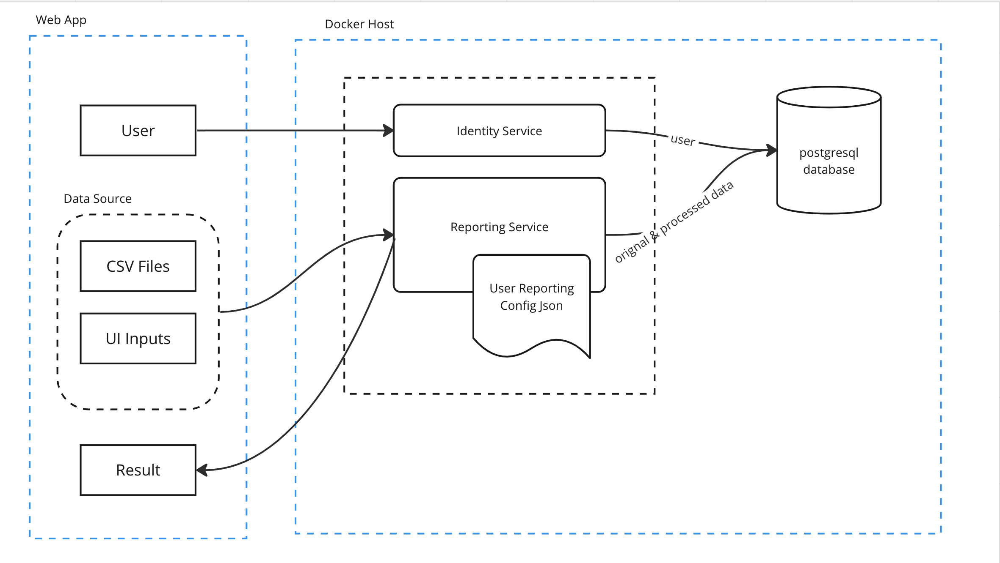

# keeper

A financial reporting tool

## Architecture


[Source](https://miro.com/app/board/uXjVMWXddkA=/)

There are 2 services:

- Configuring Service:

  It manages the reporting configuration. The reporting configuration indicates how the report is created from the data source.

  It's a CRUD API.

  - Create a config: It must have a username and UID.

  - Read a config

  - Update a config: Only the reporting configuration can be updated. Username and UID is immutable.

  - Delete a config: delete all the transactions and reports linked to it, too.

- Reporting Service:

  It collects the transactions and build the report from them.

  It follows CQRS architecture pattern.

  - **Add transactions command**

  - **Upload a CSV file of transaction command**

  - **Build a report command**: It receives the command that asks the App to read the data from database, create the report, and save the results into database

  - **Get a report query**: It returns the reporting result.

## Usage

To run the project in Development mode on the local machine

```code
docker compose up
```

## Development

Run the project locally. Please lanuch **MongoDB** on your local machine.

## ITest

```code
docker compose -f docker-compose-test.yml -f docker-compose-test.override.yml up
```
