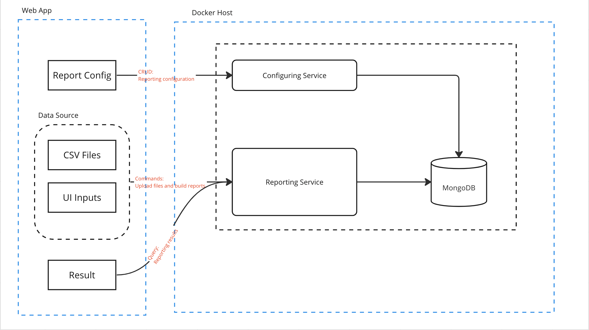

# keeper

A financial reporting tool

## Architecture

There are 2 services:

- Identity Service: It manages the user (sign in & sign out).

- Reporting Service: It's composed by 2 parts

  - **Reporting Controller**: It has 2 endpoint

    - `POST`: It receives the data sources from the web app, and return nothing if success
    
    - `GET`: It returns the reporting results.

  - **Reporting Service**: 

    1. It maps the requests to the internal data structures.

    2. It creates the reports based on the local **user reporting config json**. This config file is attached to a user by his `user_id`

    3. It saves the orginal data and reporting data into the database. 
